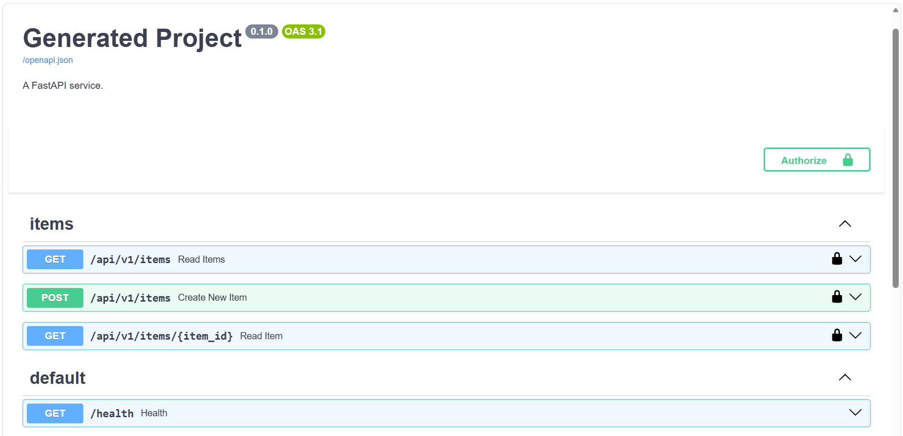

# Modern Python FastAPI Template

A production-ready FastAPI project template powered by **uv**.

This template provides a batteries-included setup with modern tooling, strict linting, automatic formatting, and CI/CD integration, all configured to work out of the box.

It is designed to work seamlessly with the [frontend template](https://github.com/Victor02091/template_react_front) for a complete full-stack setup.

## ✨ Features

* **Framework:** [FastAPI](https://fastapi.tiangolo.com/) with async support and automatic OpenAPI docs.
* **Package Manager:** [uv](https://github.com/astral-sh/uv) (blazing fast replacement for pip/poetry).
* **Linter & Formatter:** [Ruff](https://github.com/astral-sh/ruff) (configured for strict imports and formatting).
* **Type Checking:** Standard Mypy.
* **Configuration:** [Pydantic Settings](https://docs.pydantic.dev/latest/concepts/pydantic_settings/) for type-safe environment variable management with validation.
* **Authentication:** [OIDC](https://openid.net/connect/) support with automatic JWT signature validation and secure route dependencies (optional).
* **Identity Provider:** Local [Keycloak](https://www.keycloak.org/) container pre-configured with mock users for instant local development (optional).
* **Pre-commit:** Automatic hooks to ensure code quality before every commit (optional).
* **CI/CD:** CI pipelines for GitHub Actions, GitLab CI, or Bitbucket Pipelines (optional).
* **Containerization:** Dockerfile and docker-compose included.
* **Database:** [SQLAlchemy](https://www.sqlalchemy.org/) ORM with async support, [Alembic](https://alembic.sqlalchemy.org/) migrations, and [PostgreSQL](https://www.postgresql.org/) via `asyncpg` pre-configured.
* **Editor:** VS Code settings (extensions, and linting) pre-configured.

## 📸 Swagger UI Preview



## 📂 Project Structure

The template generates a clean, production-ready directory layout:

```
your-project/
├── app/
│   ├── api/          # Route definitions
│   ├── core/         # Settings and configuration
│   ├── db/           # Database session and engine
│   ├── models/       # SQLAlchemy models
│   ├── schemas/      # Pydantic schemas
│   ├── services/     # Business logic
│   └── main.py       # FastAPI application entrypoint
├── migrations/       # Alembic migration files
├── Dockerfile
├── docker-compose.yml
├── Makefile
└── pyproject.toml
```

## 🛠️ Requirements

You **do not** need to install Python manually. The package manager `uv` handles Python versions automatically.

You only need:
1.  **Git**
2.  **uv**

### How to install uv

**On Linux / macOS:**

    curl -LsSf https://astral.sh/uv/install.sh | sh

**On Windows:**

    powershell -ExecutionPolicy ByPass -c "irm https://astral.sh/uv/install.ps1 | iex"

*More info on the [official website](https://docs.astral.sh/uv/getting-started/installation/#__tabbed_1_1).*

## 📦 Installation

This template is built with **Copier**. You can install Copier globally using `uv` (recommended).

**Important:** This template uses custom extensions. You must install Copier with the `copier-template-extensions` plugin.

    uv tool install copier --with copier-template-extensions

## 🚀 Usage

**Prerequisites:**
1.  Create a new repository (or folder) and open it in your terminal.
2.  **Ensure the folder is completely empty** (except for the `.git` folder if you cloned a new repository).

Run the generation command inside your empty folder:

    copier copy --trust https://github.com/Victor02091/template_python_fastapi .

### Update values of an existing project

If you have already generated a project and want to change the current values, like updating the Python version:

    copier update --vcs-ref=:current: --trust --defaults --data python_version="3.13"

### Update template of an existing project

If you have already generated a project and want to pull the latest updates from the template:

    copier update --trust

---

## 📋 Template Parameters

During generation, Copier will ask you a series of questions. Here is a quick reference for what each parameter controls:

### General Settings
* **`project_name`**: The human-readable name of your project. Used in `pyproject.toml` (auto-slugified) and Docker configs. *(Default: Current folder name)*
* **`description`**: A short summary of what the project does. *(Default: "A FastAPI service.")*
* **`author_name`** & **`author_email`**: Package metadata injected into `pyproject.toml`. *(Default: Your global git config)*
* **`python_version`**: Pins the Python version across the entire stack (`uv`, `.python-version`, Dockerfile, and CI/CD). *(Choices: 3.9 to 3.13 | Default: 3.12)*

### Tooling & CI/CD
* **`add_pre_commit`**: Generates a `.pre-commit-config.yaml` with Ruff and Mypy hooks to enforce code quality locally. *(Default: true)*
* **`add_ci`**: Generates a CI pipeline workflow. *(Default: true)*
* **`ci_provider`**: Selects the target CI platform (`Github Actions`, `GitLab CI`, or `Bitbucket Pipelines`). *(Condition: `add_ci` is true)*
* **`install_dependencies`**: Automatically runs `uv sync` to build the `.venv` immediately after generation. *(Default: true)*
* **`install_pre_commit_hooks`**: Automatically registers the git hooks in your local `.git` folder. *(Condition: pre-commit and dependencies are enabled)*

### Authentication (OIDC)
* **`use_oidc`**: Protects the API with OpenID Connect. Adds JWT signature validation, auth dependencies (`app/api/deps.py`), and injects env vars. *(Default: true)*
* **`oidc_provider`**: *(Condition: `use_oidc` is true)*
  * `Local Keycloak`: Spins up a pre-configured local Keycloak container via `docker-compose` with mock users. Ideal for local development.
  * `External IdP`: Skips Keycloak and points your API directly to an existing provider (Okta, Auth0, Azure AD, etc.).
* **`oidc_client_id`**: The OAuth 2.0 Client/App ID from your external provider. Validates the `aud` token claim. *(Condition: External IdP is selected)*
* **`oidc_authority`**: The issuer URL (e.g., `https://your-tenant.auth0.com/`) used to fetch the JWKS and verify token signatures. *(Condition: External IdP is selected)*